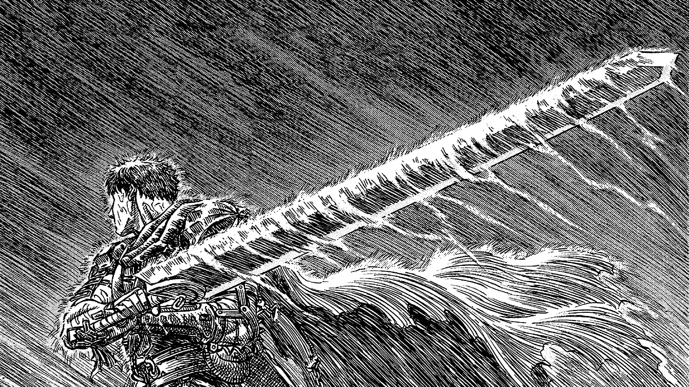

# ASCII Art Wallpaper Generator

[](https://opensource.org/licenses/MIT)

A professional-grade application that transforms images into colorful ASCII art, with fine-grained control over conversion parameters, multiple output formats, and advanced features like directional character selection and high-density mode.

<p align="center">
    <h3> Original: </h3>
    
    <h3> ASCII: </h3>
    
</p>

## 🌟 Features

- **High-quality ASCII Conversion**: Transform any image into detailed ASCII art
- **Multiple Character Sets**: Standard, detailed, simple, blocks, minimal, manga, diagonal
- **Color Support**: Full RGB color output or monochrome
- **Directional Character Selection**: Intelligent character mapping that follows image contours
- **High-Density Mode**: Generate extremely detailed ASCII art with configurable density
- **Multiple Output Formats**: 
  - Terminal text output
  - HTML with CSS styling
  - PNG, JPG, or other image formats
  - Live wallpaper (experimental)
- **Advanced Image Processing**: Apply preprocessing filters like edge detection and contrast enhancement
- **Comprehensive Logging**: Debug-friendly detailed logs to track processing
- **Interactive Interfaces**: Command-line, GUI, and web dashboard options

## 📋 Requirements

- Python 3.7+
- Pillow (PIL) 11.2.0+
- NumPy 1.21.0+
- TkInter (for GUI mode)
- Other dependencies listed in `requirements.txt`

## 🔧 Installation

```bash
# Clone the repository
git clone https://github.com/arhammxo/asciiWallpaper.git
cd asciiWallpaper

# Create a virtual environment (optional but recommended)
python -m venv venv
source venv/bin/activate  # On Windows: venv\Scripts\activate

# Install dependencies
pip install -r requirements.txt
```

## 🚀 Quick Start

Convert an image to ASCII art with default settings:

```bash
python main.py -i path/to/image.jpg -o output.txt
```

Generate a colorful PNG version:

```bash
python main.py -i path/to/image.jpg -c -f png -o output.png
```

Launch the GUI interface:

```bash
python main.py -g
```

## 💻 Usage Examples

### Basic Conversion

```bash
# Convert to plain text
python main.py -i images/photo.jpg -o ascii_output.txt

# Convert with color to HTML
python main.py -i images/photo.jpg -c -f html -o ascii_output.html

# Convert to PNG with color
python main.py -i images/photo.jpg -c -f png -o ascii_output.png
```

### Advanced Features

```bash
# High detail with directional characters using manga character set
python main.py -i images/manga.jpg -c -f png -o manga_output.png --charset manga --directional --preprocess sharpen

# Ultra-detailed with original dimensions
python main.py -i images/detailed.jpg -c -f png -o detailed_output.png --high-density --charset detailed --directional --preprocess edge --fontsize 8 --keepdims

# Custom dimensions with contrast enhancement
python main.py -i images/landscape.jpg -c -f png -o custom_size.png --outputwidth 1920 --outputheight 1080 --contrast 1.5
```

## 📊 Command Line Arguments

| Argument | Description | Default |
|----------|-------------|---------|
| `-i, --input` | Input image path | |
| `-o, --output` | Output file path | `ascii_art.[format]` |
| `-w, --width` | Width in characters | 100 |
| `-ht, --height` | Height in characters | 50 |
| `-c, --color` | Enable color output | False |
| `-cs, --charset` | Character set to use | standard |
| `-f, --format` | Output format (txt, html, png, jpg) | txt |
| `-g, --gui` | Start with GUI interface | False |
| `-b, --brightness` | Brightness adjustment (0.1-2.0) | 1.0 |
| `-ct, --contrast` | Contrast adjustment (0.1-2.0) | 1.0 |
| `-iv, --invert` | Invert character mapping | False |
| `-d, --debug` | Enable debug logging | False |
| `--directional` | Enable directional character selection | False |
| `--preprocess` | Preprocessing method (none, edge, sharpen, contrast) | none |
| `--high-density` | Use high-density mode for more detailed ASCII | False |
| `--density-factor` | Density multiplier for high-density mode | 1.0 |
| `--keepdims` | Keep original image dimensions for output | False |
| `--outputwidth` | Custom output image width | |
| `--outputheight` | Custom output image height | |
| `--fontsize` | Font size for image output | 12 |

## 🎨 Character Sets

| Character Set | Description | Example Characters |
|---------------|-------------|-------------------|
| `standard` | Balanced character density | `@%#*+=-:. ` |
| `detailed` | Full range of ASCII characters | `$@B%8&WM#*oahkbdpqwmZO0QLCJUYXzcvunxrjft/\|()1{}[]?-_+~<>i!lI;:,"^'.` |
| `simple` | Simplified character set | `#@%*+=-:. ` |
| `blocks` | Unicode block characters | `█▓▒░ ` |
| `minimal` | Minimal character set | `@:. ` |
| `manga` | Optimized for line art and manga | `█▓▒░@%#*/\()[]{}=_-+~<>!;:,. ` |
| `diagonal` | Enhanced directional characters | `\|/─│┌┐└┘┼▄▀█▓▒░ ` |

## 🔍 Processing Modes

### High-Density Mode

High-density mode calculates the perfect number of ASCII characters needed to fill the target dimensions, creating extremely detailed ASCII art. Enable with `--high-density`:

```bash
python main.py -i image.jpg -c -f png -o hd_output.png --high-density --fontsize 8 --keepdims
```

Control the density with `--density-factor` (higher values = more characters):

```bash
python main.py -i image.jpg -c -f png -o ultra_hd.png --high-density --density-factor 2.0 --fontsize 8
```

### Directional Mode

Directional mode analyzes the image to detect edges and lines, then selects ASCII characters that match the detected directions. This creates ASCII art that better follows the contours of the original image:

```bash
python main.py -i manga.jpg -c -f png -o directional.png --directional --charset manga
```

Works best with character sets that include directional characters like `manga` or `diagonal`.

### Preprocessing Options

Enhance your ASCII art with image preprocessing:

- `--preprocess edge`: Highlight edges for line art and manga
- `--preprocess sharpen`: Enhance details
- `--preprocess contrast`: Increase the contrast for better character mapping

```bash
python main.py -i photo.jpg -c -f png -o enhanced.png --preprocess sharpen
```

## 📈 Logging and Debugging

The application includes comprehensive logging to help diagnose issues:

```bash
# Enable debug logging
python main.py -i image.jpg -o output.txt -d

# View logs with the log viewer
python tools/log_viewer.py

# Run the log analysis dashboard (requires Flask)
python tools/log_dashboard.py
```

## 🏗️ Project Structure

```
ascii_wallpaper/
├── core/
│   ├── image_processor.py     # Image loading and manipulation
│   ├── ascii_converter.py     # ASCII conversion logic
│   ├── color_handler.py       # Color processing
│   └── output_formatter.py    # Output format handling
├── ui/
│   ├── cli.py                 # Command-line interface
│   ├── gui.py                 # GUI with tkinter
│   └── web_server.py          # Simple web interface
├── utils/
│   ├── config.py              # Configuration handling
│   ├── logger.py              # Logging system
│   ├── performance.py         # Performance tracking
│   └── file_manager.py        # File operations
├── tools/
│   ├── log_viewer.py          # Log analysis tool
│   ├── log_dashboard.py       # Web-based log dashboard
│   ├── profiling_report.py    # Performance report generator
│   └── debug_image_gen.py     # Font/image debugging tool
├── presets/
│   ├── character_sets.py      # Predefined character sets
│   ├── color_schemes.py       # Color schemes
│   └── fonts/                 # Font files
├── logs/                      # Log directory
├── examples/                  # Example images and outputs
├── main.py                    # Main entry point
├── requirements.txt           # Dependencies
└── README.md                  # This file
```

## 🔍 Technical Details

### Image Processing Pipeline

1. **Loading**: Load source image with Pillow
2. **Preprocessing**: Apply optional filters (edge detection, sharpening, etc.)
3. **Resizing**: Resize to target ASCII dimensions with aspect ratio preservation
4. **ASCII Conversion**: Map pixels to characters based on intensity and direction
5. **Color Mapping**: Apply color to characters based on pixel color
6. **Output Formatting**: Generate output in requested format (text, HTML, image)

### Font Handling

The application tries to load a custom monospace font (DejaVu Sans Mono) but falls back to the system default if not available. For image output, font size affects the detail level—smaller fonts yield more detailed ASCII art.

### Character Mapping

Characters are mapped based on pixel intensity (brightness) from dark to light. In directional mode, the gradient direction influences character selection to better represent image contours.

## 🛠️ Troubleshooting

### Common Issues

**Problem**: Output image dimensions don't match original
**Solution**: Use `--keepdims` and `--high-density` flags together

**Problem**: Pillow API compatibility issues ('getsize' attribute error)
**Solution**: Update to the latest code which supports both old and new Pillow APIs

**Problem**: Missing font error
**Solution**: The app will fall back to the system default font. Install DejaVu Sans Mono for best results

### Debugging Tools

- Run `debug_image_gen.py` to test font rendering
- Check logs in the `logs/` directory
- Use `log_viewer.py` to analyze log files
- Enable debug mode with `-d` flag

## 🤝 Contributing

Contributions are welcome! Please feel free to submit a Pull Request.

1. Fork the repository
2. Create your feature branch (`git checkout -b feature/amazing-feature`)
3. Commit your changes (`git commit -m 'Add some amazing feature'`)
4. Push to the branch (`git push origin feature/amazing-feature`)
5. Open a Pull Request

## 📄 License

This project is licensed under the MIT License - see the LICENSE file for details.

## 🙏 Acknowledgments

- [Pillow](https://python-pillow.org/) for image processing
- [NumPy](https://numpy.org/) for numerical operations
- All the ASCII art pioneers who inspired this project